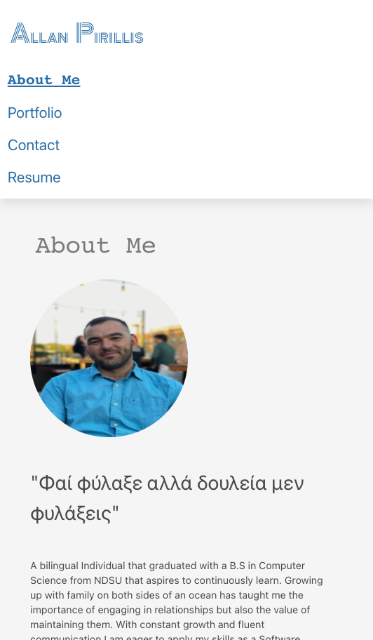

# 20-react-portfolio

## Description

My portfolio using React to create a Single Page Application that conditionaly renders different components based on the user"

---

## Link to Deployed Application

https://allanp94.github.io/20-react-portfolio/

---

## Table of Contents

- [Installation](#installation)
- [Usage](#usage)
- [License](#license)
- [Questions](#questions)

---

## Installation

Clone the repository to your local machine; run npm init; run npm install; run npm start to start the server"

---

## Usage

The project will be used as allanp94's portfolio

---

## License

---

## Contributing

- Sole contributor for the portfolio was allanp94

---

## Tests

The project was extensively tested by allanp94 for all required functionality

---

## Questions

Github Name: allanp94
(https://www.github.com/allanp94)

Please contact me with any questions/opportunities at my email listed below.
Email: allan.p94@gmail.com

---

## Screenshot

